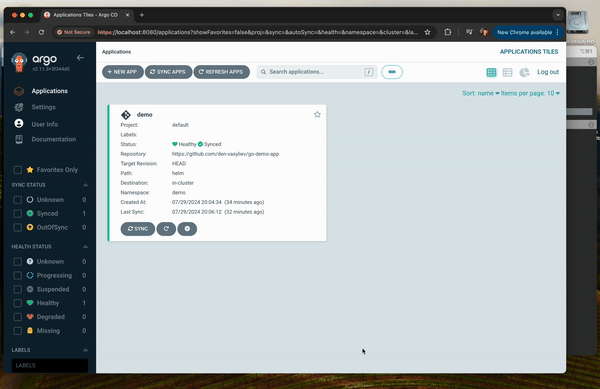

# MVP: Running Application in ArgoCD inside Kubernetes with Port Forwarding Demo

## Overview

This document provides a video demonstration of our application running within ArgoCD in a Kubernetes cluster. The demo showcases the setup and execution of the application with port forwarding enabled.

## Video Demonstration

## Conclusion

This video demonstrates the seamless integration of ArgoCD for application deployment and management in a Kubernetes environment, highlighting the ease of accessing the application through port forwarding.
